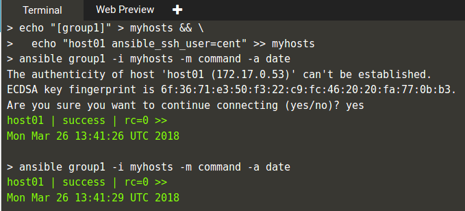

# Ansible
Ansible adalah sebuah perangkat lunak komputer atau software yang dapat membantu seorang devops atau sistem administrator untuk melakukan otomasi di servernya. Ansible dapat membantu melakukan instalasi, deployment, bahkan mengupdate server.

**konfigurasi CentOS dengan Ansible**
****

**Task dan Hosts**

Ansible menjalankan task dalam host, dan yang dibutuhkan adalah SSH. Dengan kata lain, Ansible berjalan di satu tempat (laptop, deploy box, atau ditempat lain), membuka koneksi SSH ke remote host dan menjalankan command secara langsung.

**Task**

Dapat berupa apa saja dari membuat bucket di AWS S3, ke menjalankan instance di Azure, menginstall pip di server, mengupdate file config, atau sekedar mengecek waktu pada remote host.

**Host**

Adalah tempat task berjalan. Dalam berupa beberapa remote host yang dapat diakses SSH, atau localhost. Ip address dan hostname Host disimpan dalam file inventory agar dapat diketahui oleh Ansible. Ketika Ansible dijalankan, kita dapat memilih 1 atau lebih host, atau kelompok host, yang didefinisiakan di inventory file.

**Membuat inventory**

echo "[group1]" > myhosts

myhost adalah nama inventory, dengan nama group: group1.

echo "host01 ansible_ssh_user=ubuntu" >> myhosts

dilakukan untuk menambahkan host dengan nama host01 ke dalam group.

Untuk menjalankan task ad-hoc, menggunakan module tunggal, dengan ‘ansible’
Sebagai contoh untuk menampilkan tanggal dan waktu pada remote host:

ansible group1 -i myhosts -m command -a date

group1 adalah group yang dijalankan, myhost adalah nama inventory file, date adalah argumen dari module command.

